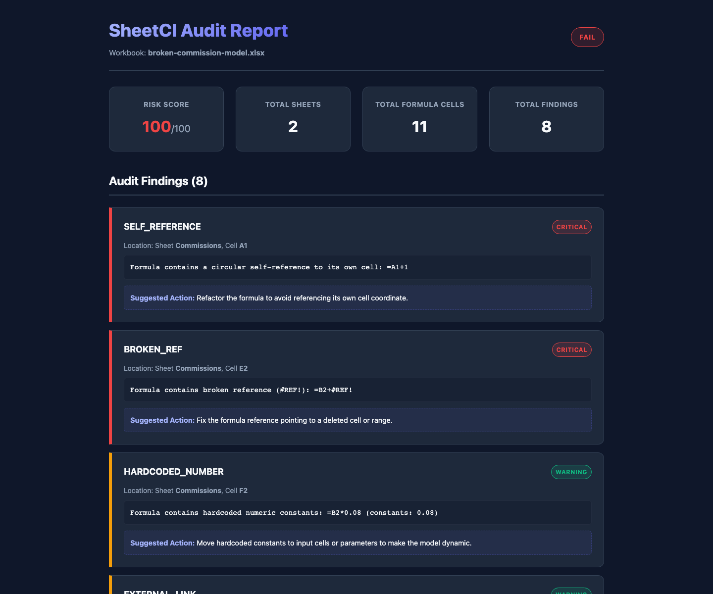

# SheetCI

[](https://github.com/madara88645/SheetCI/actions/workflows/ci.yml)

SheetCI is a CLI-first tool that checks business-critical Excel spreadsheets (`.xlsx`) for risky formulas and produces audit reports. Think of it as a **linter, tester, and CI guardrail for Excel files**.

With SheetCI, you can catch silent spreadsheet bugs (like broken references, circular formulas, or hardcoded values in calculations) before they make it into production or financial reports.



---

## Why SheetCI?

Spreadsheets often run important business logic, but they usually do not get the same checks as code. A small formula change can silently alter revenue, commission, budget, pricing, or reporting outputs.

SheetCI gives teams a local, deterministic scan before a workbook is shared, committed, or used for a decision.

---

## Use Cases

- Finance models with fragile formulas or hidden sheets
- Sales commission workbooks
- Pricing and margin calculators
- Budget and planning spreadsheets
- Ops or RevOps reporting workbooks
- Pull requests that include `.xlsx` files

---

## Local-First

SheetCI runs on your machine or in your CI workflow. The MVP does not upload workbooks, use a database, call an LLM API, or send file contents to a cloud service.

---

## Quickstart

### 1. Installation
To install SheetCI in editable mode for local development, run:

```bash
pip install -e .
```

### 2. Basic Usage
Scan any workbook using the `sheetci` command:

```bash
sheetci scan examples/broken-commission-model.xlsx
```

---

## Example Commands

### Scan and Output Markdown Report
Generate a clean Markdown report with the findings detail:

```bash
sheetci scan examples/broken-commission-model.xlsx --out report.md
```

### Scan and Output HTML Report
Generate an interactive, beautiful HTML report for business or non-technical reviewers:

```bash
sheetci scan examples/broken-commission-model.xlsx --html report.html
```

### Print JSON Summary
Print a raw JSON summary to standard output (useful for CI/CD integrations):

```bash
sheetci scan examples/broken-commission-model.xlsx --json
```

---

## CI

This repository includes a GitHub Actions workflow at `.github/workflows/ci.yml`.
It runs the test suite, checks that the clean example workbook passes, and generates audit reports for the intentionally broken example workbook.

For local verification, run:

```bash
uv run pytest
uv run sheetci scan examples/clean-model.xlsx
uv run sheetci scan examples/broken-commission-model.xlsx --out report.md --html report.html
```

The broken example is expected to fail with exit code `1` because it contains intentional audit findings.

---

## Demo

The sample workbook at `examples/broken-commission-model.xlsx` intentionally includes broken references, a self-reference, a cached calculation error, an external workbook link, a hidden sheet, hardcoded numbers, and an inconsistent formula.

Run:

```bash
sheetci scan examples/broken-commission-model.xlsx --out report.md --html report.html
```

Expected result:

- Status: `FAIL`
- Risk score: `100/100`
- Findings: `8`
- Example Markdown report: [`docs/example-report.md`](docs/example-report.md)

---

## Feedback

SheetCI is an early MVP and feedback is very welcome — please [open an issue](https://github.com/madara88645/SheetCI/issues) with the workbook pattern you'd like it to catch.

---

## Core Detectors

SheetCI comes with deterministic detectors:
- **`BROKEN_REF`** (Critical): Detects formulas containing `#REF!`.
- **`SELF_REFERENCE`** (Critical): Flags formulas referencing their own cell coordinate.
- **`CACHED_ERROR`** (Critical): Catches cached Excel calculation errors (like `#DIV/0!`, `#VALUE!`).
- **`EXTERNAL_LINK`** (Warning): Flags formulas referencing external worksheets or URLs.
- **`HARDCODED_NUMBER`** (Warning): Flags magic/literal numbers embedded directly in formulas (ignoring `0`, `1`, `-1`, `2`).
- **`INCONSISTENT_FORMULA`** (Warning): Evaluates columns with at least 5 formulas to detect rows containing formula patterns that deviate from the column's 80% majority pattern.
- **`HIDDEN_SHEET`** (Warning): Identifies hidden worksheets containing hidden logic or stale data.

---

## Limitations

- **Cached Evaluation Values**: SheetCI relies on `openpyxl`'s cached formula values. If the spreadsheet has been modified outside Excel (e.g. via script) and has not been recalculated and saved by Excel, some cached values may be stale or missing.
- **No Excel Engine**: SheetCI does not evaluate or recalculate Excel formulas itself. It is a metadata scanner and auditor, not a calculation simulator.
- **Macros and VBA**: SheetCI scans cells but does not analyze VBA macro code, Power Query connections, or pivot table structures.

---

## Roadmap

- **CI/CD Integration**: Pre-built actions for GitHub Actions, GitLab CI, and Bitbucket Pipelines.
- **Custom Rules Configuration**: Allow customizing risk score weights and ignored formula numbers/functions via a `sheetci.toml` config file.
- **Critical Cell Tracing**: Flag changes in key cells (e.g., EBITDA, Total Revenue) and trace their dependencies.
